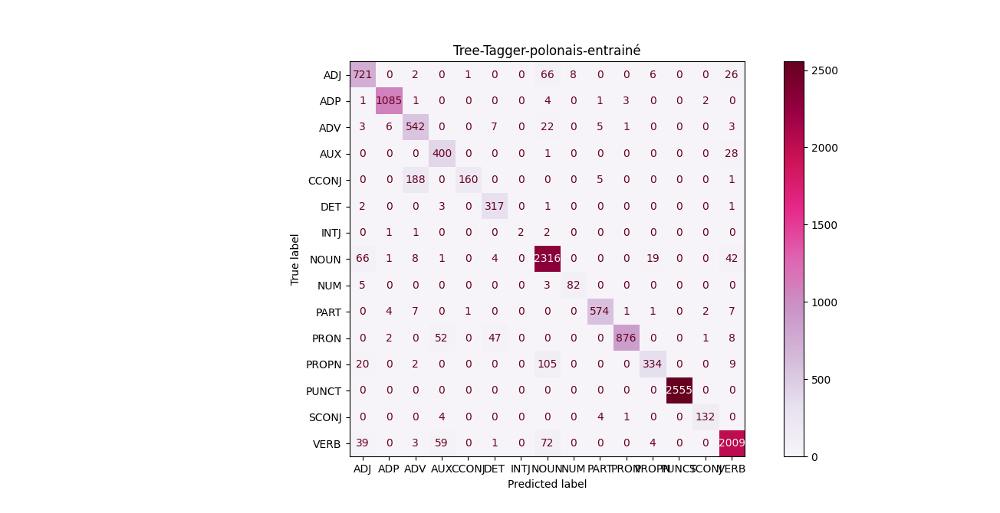

# Re-entrainement de Treetagger - (travail en groupe)

Pour se faire, nous avons suivie le guide su git : `https://gite.lirmm.fr/advanse/sentiment-analysis-webpage/-/tree/master/resources_on_server/TreeTagger` 


/!\ Se positionner dans le répértoire parent du projet /!\

## Corpus Polonais (même que spacy)

Corpus conllu pl-lfg_ud (train, dev et test)

## Installation de treetagger

`https://www.cis.uni-muenchen.de/~schmid/tools/TreeTagger/`

## Entrainement

Pour entrainer treetagger nous avons besoin de trois fichiers

### Fichier 1 : lexicon.txt

Construire un lexicon (mots formes + tag)

```python
dictionnaire : {
            "Token1" : [("Token", TAG)("Token",TAG)],
			"Token2" : [("Token2", TAG),("Token2",TAG)],
            ...
            }
```

### Fichier 2 : tags.txt

À partir d'un des corpus UD récupére tous les tags :

```python
	La \t a \t PRON \t la \t DET
```

### Fichier 3 : annotated.txt

Extraite tous les tokens du corpus avec leurs étiquettes :

```python
		Pierre \t NP
		a \t V
		la \t DET
```

## Entrainement

Lancement de l'entrainement avec la commande : `bin/train-tree-tagger -st PUNCT train-treetagger/lexicon.txt train-treetagger/tags.txt train-treetagger/annotated.txt train-treetagger/model`

(-st PUNCT' permet d'unifier avec spacy)

### Résultats

```python
569	    dig	            569
lat	    subst:pl:gen:m3	rok
temu	prep:acc	    temu
spalono	imps:perf	    spalić
na	    prep:loc	    na
stosie	subst:sg:loc:m3	stos
Joannę	subst:sg:acc:f	Joanna
D'Arc	subst:sg:nom:f	<unknown>
.	interp:sent	.
6	dig	6
```

### Observations

- Cas des NP : les mêmes formes mais pas les même lemmes.
- Tokenisation
  - Spacy :
  ```python
  [('To', 'AUX'), ('jest', 'AUX'), ('11', 'ADJ'), ('-', 'ADJ'), ('letnia', 'ADJ'), ('serdako', 'ADJ'), ('-', 'PUNCT'), ('sukienka', 'NOUN'), ('na', 'ADP'), ('ul', 'X'), ('.', 'PUNCT'), ('czerstwej', 'ADJ')]
  ```
  - Treetagger :
  ```python
  11-letnia ADJ
  serdako-sukienka NOUN
  Ul. NOUN
  ```

### Solutions

Calculer la F-mesure au lieu de l'accuracy

## Test
Récupérer le texte de test depuis pl_lfg-ud --> on s'est trompé, le fichier ne devait pas être un bloc de texte mais de tokens (1 par ligne).

**Altérnative :** récupérer la tokenization de spacy afin d'éviter les potentielles incohérences.
PS : le but n'est pas l'évaluation des tokens.

`bin/tree-tagger train-treetagger/model-name train-treetagger/text4TT.txt train-treetagger/annotation_treetagger.txt -token`

## Évaluation
```python
TREE-TAGGER RESULTS ORIGINAL
news
(0.8034082923401265, 0.8056910569105691)
fiction
(0.8001316005922027, 0.8257142857142857)
(media)
(0.9076923076923077, 1.0)
social
(0.7912457912457912, 0.8431372549019608)
(conversational)
(0.8115631691648822, 0.8181818181818182)
nonfiction
(0.7912663755458516, 0.8733624454148472)
(prepared)
(0.8537234042553191, 0.7714285714285715)
legal
(0.7, 0.75)
blog
(0.7565217391304347, 0.7777777777777778)
academic
(0.6363636363636364, 1.0)

              precision    recall  f1-score   support
         ADJ       0.71      0.85      0.77       830
         ADP       0.99      0.99      0.99      1097
         ADV       0.98      0.95      0.97       589
         AUX       0.00      0.00      0.00       429
       CCONJ       0.00      0.00      0.00       354
        CONJ       0.00      0.00      0.00         0
         DET       0.00      0.00      0.00       324
        INTJ       0.71      0.83      0.77         6
        NOUN       0.78      0.97      0.86      2457
         NUM       0.59      1.00      0.74        90
        PART       0.58      0.95      0.72       597
        PRON       1.00      0.40      0.57       986
       PROPN       0.00      0.00      0.00       470
       PUNCT       1.00      1.00      1.00      2555
       SCONJ       0.00      0.00      0.00       141
        VERB       0.79      0.99      0.88      2187
           X       0.00      0.00      0.00         0

    accuracy                           0.80     13112
   macro avg       0.48      0.53      0.49     13112
weighted avg       0.75      0.80      0.76     13112

TREE-TAGGER RESULTS ENTRAINE
news
(0.9219957835558679, 0.8146341463414634)
fiction
(0.922520151340681, 0.7914285714285715)
(media)
(0.9384615384615385, 1.0)
social
(0.9292929292929293, 0.7450980392156863)
(conversational)
(0.9229122055674518, 0.8409090909090909)
nonfiction
(0.9126637554585153, 0.7947598253275109)
(prepared)
(0.9627659574468085, 0.7714285714285715)
legal
(0.8, 0.5)
blog
(0.9043478260869565, 0.7777777777777778)
academic
(0.6363636363636364, 0.3333333333333333)

              precision    recall  f1-score   support
         ADJ       0.84      0.87      0.85       830
         ADP       0.99      0.99      0.99      1097
         ADV       0.72      0.92      0.81       589
         AUX       0.77      0.93      0.84       429
       CCONJ       0.99      0.45      0.62       354
         DET       0.84      0.98      0.91       324
        INTJ       1.00      0.33      0.50         6
        NOUN       0.89      0.94      0.92      2457
         NUM       0.91      0.91      0.91        90
        PART       0.97      0.96      0.97       597
        PRON       0.99      0.89      0.94       986
       PROPN       0.92      0.71      0.80       470
       PUNCT       1.00      1.00      1.00      2555
       SCONJ       0.96      0.94      0.95       141
        VERB       0.94      0.92      0.93      2187

    accuracy                           0.92     13112
   macro avg       0.92      0.85      0.86     13112
weighted avg       0.93      0.92      0.92     13112
```

## Matrices de confusion
### Tree-Tagger-polonais


### Tree-Tagger-polonais-entrainé


